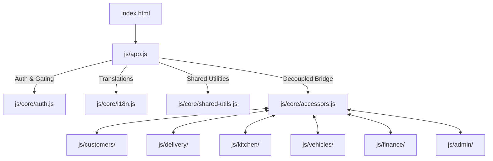

# Project Memory: Healthy Home's Foods Enterprise Dashboard

This document details the system design, modular architecture, core business data flows, and configuration for developers and AI agents.

---

## 🏗️ Rebuilt Modular Architecture

The dashboard has been fully rebuilt as a pure static client-side application utilizing **ES6 Native Modules** and the **Firebase v9 Modular SDK** (via Google standard CDNs). There are no package bundlers or compilation steps.

### Architecture Map

### Decoupled 3-File Domain Pattern
No feature domain imports another domain's files directly. If Domain A requires access to Domain B's data or logic, it communicates through the shared accessors registry bridge:
1.  **`<domain>-firestore.js`**: Handles collection subscriptions and DB writes.
2.  **`<domain>-logic.js`**: Performs pure computations, arithmetic, and validation filters.
3.  **`<domain>-render.js`**: Coordinates DOM updates, grid generations, and dialog triggers.

---

## 📅 Timezone-Safe Date Operations

All dates are parsed and formatted using local timezone values inside `js/core/shared-utils.js` to prevent the Indian Standard Time (UTC+5:30) offset boundary bug:
*   `parseLocalDate(dateStr)`: splits `YYYY-MM-DD` and creates `new Date(y, m-1, d)`.
*   `formatLocalDate(date)`: returns Swedish zero-padded format `YYYY-MM-DD`.

---

## 🛡️ Role Gating Rules

Access boundaries have been bypassed inside `js/core/auth.js`. The module automatically mocks an active session with the `admin` role on startup. This allows anyone loading the dashboard directly on Netlify or localhost to bypass sign-in modals and instantly gain full administrative access to all navigation tabs.

